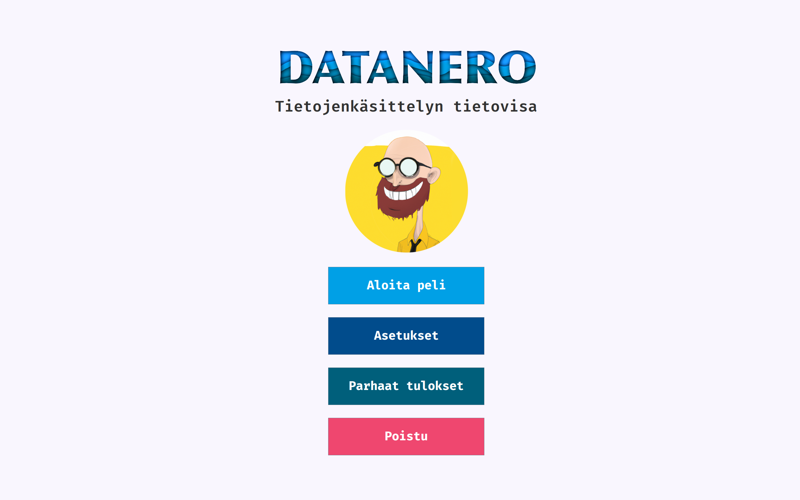
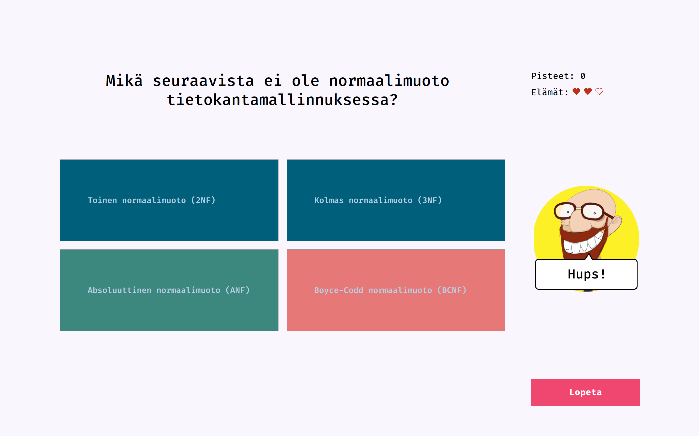

# DATANERO

DataNero on vuonna 2023 Oulun Yliopiston tietojenkäsittelytieteiden ohjelmointikurssille toteutettu tietovisailuhenkinen peli.

Peli sisältää kysymyksiä tietojenkäsittelytieteiden tutkinto-ohjelman aihepiiristä. Pelaaja vastaa monivalintakysymyksiin ja yrittää oikeilla vastauksillaan kerryttää itselleen mahdollisimman suuren pistepotin.

Peli on ennen kaikkea hyvä ohjelmoinnin oppimisen keino kehittäjilleen, mutta pelin ajatus on myös edistää tietojenkäsittelytieteiden opintojen teoreettisten kysymysten hallintaa pelillisin elementein. Peli on suunniteltu ensisijaisesti tietojenkäsittelytieteiden opiskelijoille, mutta se sopii myös muille aihepiiristä kiinnostuneille tahoille, kuten sivuaineopiskelijoille, harrastelijoille tai opettajille.

Peli on standalone -sovellus, joka ei tarvitse internet -yhteyttä toimiakseen. Pelistä on suunnitteilla myös versio, joka käyttää internetiä muodostaakseen kaikista pelin pelaajista koostuvan high score -taulukon. Myös täysin web-pohjainen, selaimella toimiva versio on harkinnassa.

Pelin voi käynnistää joko komentoriviltä tai ajamalla lähdekoodin esimerkiksi VS Code -IDE:llä. Komentoriviltä peli käynnistetään ajamalla mukana tuleva JAR (with dependencies) -tiedosto java -jar -komennolla. Esimerkiksi JAR-tiedoston nimen ollessa **datanero-1.0-SNAPSHOT-jar-with-dependencies** ajamiseen tarvittava komento on kokonaisuudessaan:
>`java -jar datanero-1.0-SNAPSHOT-jar-with-dependencies.jar`